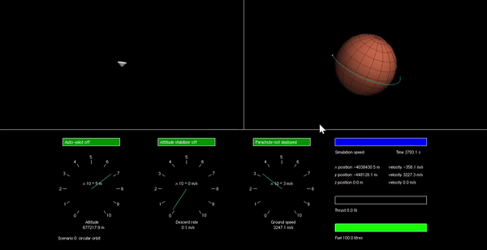

# Mars Lander Simulator
This is the Part IB Summer Holiday computing activity at the Department of Engineering, University of Cambridge.

The aim of the project is to build a physics engine for a Mars Lander simulator and program an autopilot to successfully land the Mars Lander.

The graphics and framework was written by Professors Andrew Gee and Gabor Csanyi, while the physics engine and the autopilot were written by Nicholas Ho.

## Installation
Assignment 1 called for the implementation of the Euler and Verlet numerical integration methods in one-dimension via an oscillating spring, while Assignment 2 extended the numerical integration to three-dimensions for planetary orbit.

The code for Assignments 1 and 2 are written in **Python**. The libraries `NumPy` and `Maplotlib` are required.

Assignment 3 was for the familiarisation of writing in C++, and is simply a port of Assignment 1. Assignment 4 and 5 use the same code base and graphics. The physics engine for the Mars Lander simulator was written for Assignment 4 and the autopilot (for scenario 1) for Assignment 5. 

The code for Assignments 3, 4 and 5 are written in **C++**. The code for Assignment 3 has been pre-compiled using the MSVC compiler. The Mars Lander simulator (Assignments 4 and 5) are a Visual Studio C++ project and must be run from Visual Studio with `nupengl.core` installed.

## Autopilot Demo
